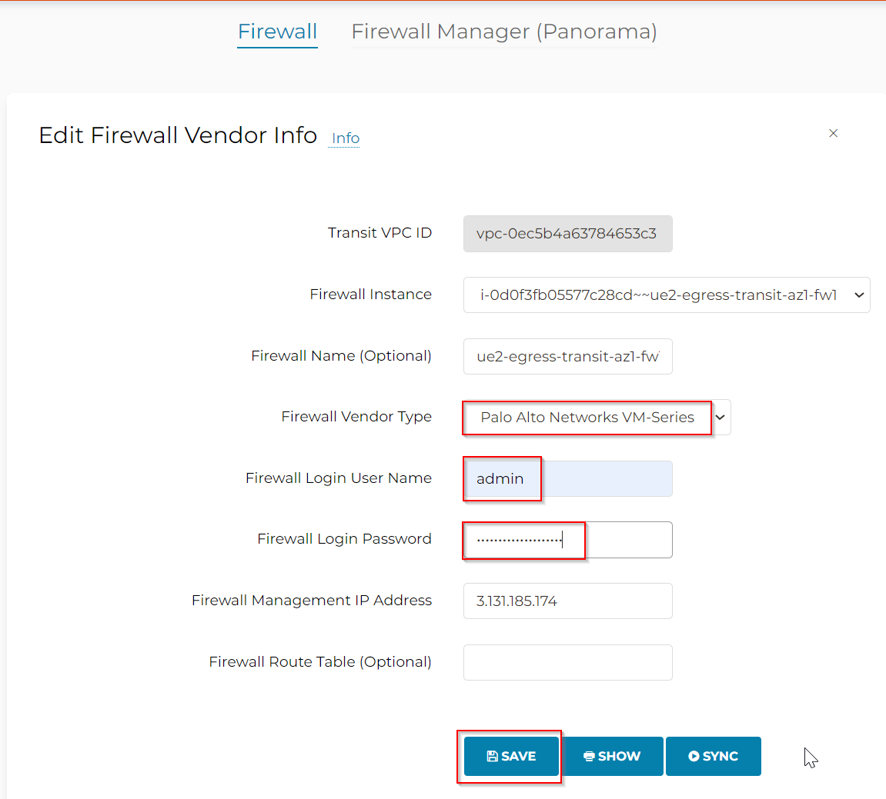

## Architecture


## Palo Password
```
YW3usHoAhrFEw0WiwFfd
```

## Vendor integration

Go to Controller > Firewall Network > Vendor Integration > Select Firewall -> Edit



Change Firewall Vendor Type -> Palo Alto Network VM-Series
Firewall Login User Name -> Admin
Firewall Login Password -> ****

Click on Save

Aviatrix Controller will then be able to manage the route table in the firewall:


## Reference


[Aviatrix Transit FireNet - Configuring Palo Alto in AWS](https://docs.aviatrix.com/documentation/latest/firewall-and-security/firenet-paloalto-aws.html)
[Aviatrix - Bootstrap Configuration Example for VM-Series in AWS](https://docs.aviatrix.com/documentation/latest/firewall-and-security/paloalto-bootstrap-aws.html)
[Palo Alto - Bootstrap](https://docs.paloaltonetworks.com/vm-series/9-1/vm-series-deployment/bootstrap-the-vm-series-firewall/bootstrap-the-vm-series-firewall-in-aws)
